[](https://classroom.github.com/a/osI6zUIF)

# Explainable AI Assignment 2 - Model Explanations

In this assignment, you are challenged to explain a model. For this, you will research exisiting approaches and apply them to your model and interpret the results.

## General Information Submission

For the intermediate submission, please enter the group and dataset information. Coding is not yet necessary.

**Team Name:** Lazy Legends

**Group Members**

| Student ID | First Name | Last Name | E-Mail                | Workload [%] |
| ---------- | ---------- | --------- | --------------------- | ------------ |
| K12331691  | Alba       | Huti      | albahuti23@gmail.com  | 25%          |
| K51841985  | Hannah     | Aster     | hannah.aster@gmx.at   | 25%          |
| K12317779  | Liza       | Lengyel   | lengyellyza@gmail.com | 25%          |
| K12336312  | Petra      | Jósár     | jpetra0314@gmail.com  | 25%          |

## Final Submission

The submission is done with this repository. Make to push your code until the deadline.

The repository has to include the implementations of the picked approaches and the filled out report in this README.

- Sending us an email with the code is not necessary.
- Update the _environment.yml_ file if you need additional libraries, otherwise the code is not executeable.
- Save your final executed notebook(s) as html (File > Download as > HTML) and add them to your repository.

## Development Environment

Checkout this repo and change into the folder:

```
git clone https://github.com/jku-icg-classroom/xai_model_explanation_2024-<GROUP_NAME>.git
cd xai_model_explanation_2024-<GROUP_NAME>
```

Load the conda environment from the shared `environment.yml` file:

```
conda env create -f environment.yml
conda activate xai_model_explanation
```

> Hint: For more information on Anaconda and enviroments take a look at the README in our [tutorial repository](https://github.com/JKU-ICG/python-visualization-tutorial).

Then launch Jupyter Lab:

```
jupyter lab
```

Alternatively, you can also work with [binder](https://mybinder.org/), [deepnote](https://deepnote.com/), [colab](https://colab.research.google.com/), or any other service as long as the notebook runs in the standard Jupyter environment.

## Report

### Model & Data

- Which model are you going to explain? What does it do? On which data is it used?
- From where did you get the model and the data used?
- Describe the model.

The dataset (SkinCancer.zip), our best classification model (best_model_classification.pth) and best segmentation model (Skin_cancer_Segmentation.keras) used in our final solution jupyter notebook (solution.ipynb) can be accessed from this link: https://drive.google.com/drive/folders/1q_ifXgKSiG2WbrCW2mn65fJZsdsT0HpG?usp=sharing

Data:

A skincancer datatset from Kaggle (https://www.kaggle.com/datasets/surajghuwalewala/ham1000-segmentation-and-classification/code) will be used for the assignment.
The data covers both a multi-classification task as well as a segmentation task with masks.
We have a Ground_truth.csv with the image ID-s and the lesion classes. We also have a folder of masks for the segmentation and the original images.
The dataset is imbalanced, the majority of the images is part of the class "melanocytic nevi (NV)". 

Features:

- Classes:

  - Actinic keratoses and intraepithelial carcinoma / Bowen's disease (AKIEC),
  - basal cell carcinoma (BCC),
  - benign keratosis-like lesions (solar lentigines / seborrheic keratoses and lichen-planus like keratoses, BKL),
  - dermatofibroma (DF),
  - melanoma (MEL),
  - melanocytic nevi (NV)
  - vascular lesions (angiomas, angiokeratomas, pyogenic granulomas and hemorrhage, VASC).


Models:

For the classification:
MobileNetV3 from Kaggle (Source: https://www.kaggle.com/code/dariusfoodeei/multiclass-skincancer-torch)

- The classification model is a pre-trained MobileNetV3-Small architecture from the above link (which is optimized for mobile and embedded devices), so it was quite quick to train the model even for 20 epochs. The final classification layer of MobileNetV3 is replaced to suit the number of classes in the skin cancer dataset, and the last layer of the classifier is modified to output predictions for these 7 classes. (A softmax layer is appended to produce probability distributions over the classes.)
- The model is only trained on the above introduced Skin Cancer Dataset, as opposed to the original source model, which also uses other datasets.
- The model is trained using CrossEntropyLoss with class weights to handle the heavy class imbalance in the dataset. (Many samples belong to class "melanocytic nevi (NV)")
- For optimization Adam optimizer with a learning rate of 3e-4 and a learning rate scheduler (ReduceLROnPlateau) are used.
- Moreover, early stopping is implemented to prevent overfitting, monitoring validation loss.
- As for data handling and data augmentation, the input images are resized to 224 × 224 pixels, random horizontal/vertical flips, rotations, and normalization are applied as data augmentation to improve generalization.
- The dataset is splitted into training, validation, and test sets (with ratio: 80%-10%-10% respectively).
- During testing, metrics such as loss, accuracy, and ROC-AUC are used to evaluate the model's performance. The test accuracy was 76.05%.
- A confusion matrix also visualizes the model’s predictions on the test data.

For the segmentation:
Fuzzy Net (https://www.kaggle.com/code/iakhtar0/2-skin-cancer-images-segmentation-fuzzy-unet)

- The segmentation model is a Fuzzy U-net architecure implementation, from the above link.
- The model is trained on the whole dataset, split into train-test-validation set.
- Adam optimizer was used (learning_rate=0.0002)
- The model is trained with a CrossEntropyLoss function, and uses metrics like binary accuracy, precision, recall, mse, dice score and iou.
- Total params in the model: 28,288,705
- It was trained for 10 epochs.
- In the final epoch the validation binary accuracy was 0.9442.

---
### Explainability Approaches

Find explainability approaches for the selected models. Repeat the section below for each approach to describe it.

For the classification:

- Class Prediction Probabilities
- GRAD-CAM
- LIME
- Entropy Visualization

For the segmentation:

- GRAD-CAM
- Occlusion sensitivity


**For Classification**

1. **Class Prediction Probabilities**
- Briefly summarize the approach.

Class Prediction Probabilities represent the likelihood that a model assigns to each class for a given input. They provide confidence scores for all classes, showing how certain the model is about its predictions. These probabilities are calculated using methods like softmax to ensure values range between 0 and 1. By visualizing these probabilities alongside true and predicted labels, they help explain the model's decision-making process. This technique is useful for both developers and non-experts to interpret model outputs and assess its reliability.

- **Description:**  
  Provides probabilistic outputs for each class, helping assess the model's confidence in its predictions.
- **Why:**  
  - Interpretability and explainability for users.
  - Aids in debugging and improving model performance.
- **Who:**  
  - Model developers and builders.
  - Non-expert users (e.g., clinicians).
- **When:**  
  After training the model.
- **Where:**  
  Used for cancer classification.
- **Purpose:**  
  Allows developers to assess prediction certainty and helps users (e.g., doctors) calibrate their trust in the model.

- Interpret the results here. How does it help to explain your model?

The visualization displays 3 correctly classified instances (marked in green) and 3 incorrectly classified instances (marked in red) from the test set, along with their corresponding class prediction probabilities. The bar plots reveal that the model frequently assigns the highest probability to the "NV" class (4 out of 6 cases), reflecting the dataset's imbalance towards this class. However, the model's confidence is low, assigning less than 0.4 probability to "NV" in all cases, with 2 out of the 3 misclassifications involving "NV" samples being incorrectly labeled as "MEL" or "AKIEC." These insights highlight the model's uncertainty and provide valuable information for developers to assess its robustness and for non-experts, such as clinicians, to appropriately calibrate their trust in the model's predictions. 

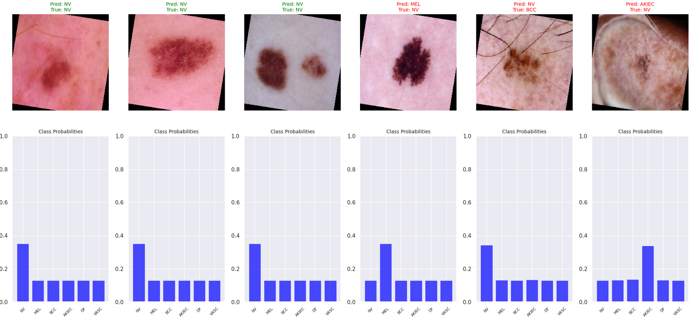

2. **GRAD-CAM (Gradient-weighted Class Activation Mapping)**
- Briefly summarize the approach.

Grad-CAM (Gradient-weighted Class Activation Mapping) is a visualization technique used to interpret the decisions of a deep learning classification model. It works by identifying the regions in an input image that contributed the most to the model's prediction for a specific class. This is achieved by backpropagating the gradients of the target class score through the final convolutional layer of the model, combining gradient information with feature maps to generate a heatmap. The resulting heatmap highlights the most influential areas in the image. By overlaying the heatmap onto the original image, Grad-CAM provides an intuitive way to understand where the model is focusing, making it easier to debug and trust the model's decisions.

- **Description:**  
  Generates heatmaps of input image regions most relevant to a classification, enhancing visual interpretability.
- **Why:**  
  - Debugging and evaluating model robustness.
  - Interpreting deep learning concepts.
- **Who:**  
  - Model developers and builders.
  - Non-expert users (e.g., clinicians).
- **When:**  
  After training.
- **Where:**  
  Applied to cancer classification.
- **Purpose:**  
  Provides insights into which image regions influence predictions, aiding in evaluating model reliability and interpretability.

- Interpret the results here. How does it help to explain your model?

The Grad-CAM visualizations highlight the regions of input images that contributed most to the model's prediction for class "NV" (0), providing insights into the model's focus. For sharp-bordered lesions, the model primarily focuses on the lesion itself, which is clinically relevant as lesion shapes and colors are important indicators for diagnosis. However, for blurry-bordered lesions, the model tends to focus on surrounding skin rather than the lesion, indicating a potential reliance on irrelevant background regions. These findings are crucial for developers to assess the model's robustness and reliability and for non-experts, such as clinicians, to interpret the model's predictions and calibrate trust in its outputs.

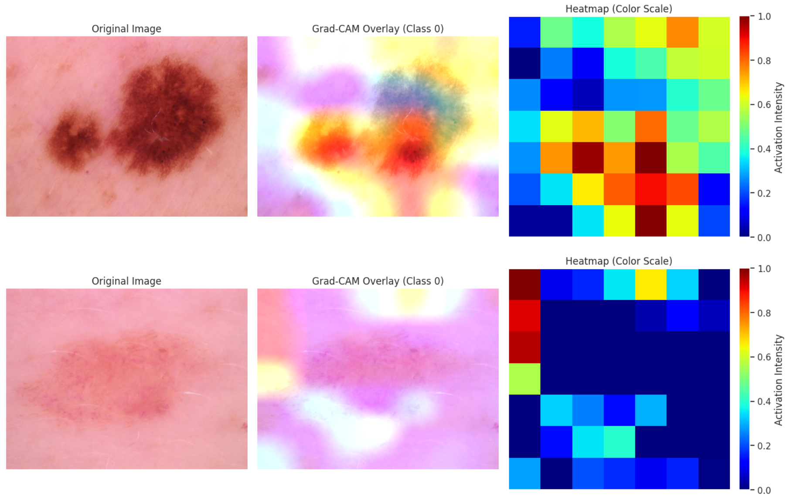

3. **LIME (Local Interpretable Model-agnostic Explanations)**
- Briefly summarize the approach.

LIME (Local Interpretable Model-Agnostic Explanations) is an explainability technique designed to provide instance-level insights into a model's decision-making process. It works by perturbing the input data (e.g., pixels in an image) and observing the model’s predictions on the modified inputs. By approximating the model's behavior locally with an interpretable surrogate (e.g., linear regression), LIME highlights the regions of the input that contribute the most to a specific prediction. This technique is model-agnostic, meaning it can be applied to any machine learning model. LIME enables developers to understand which features (e.g., image segments) were positively or negatively influential in the model's classification decision.

- **Description:**  
  Creates surrogate models to explain individual predictions in an interpretable way.
- **Why:**  
  - Debugging and comparing models.
- **Who:**  
  - Model developers and builders.
- **When:**  
  After training.
- **Where:**  
  Applied for cancer classification.
- **Purpose:**  
  Highlights influential features for specific predictions, providing insights into why a certain class was chosen.

- Interpret the results here. How does it help to explain your model?

The LIME visualization highlights the specific regions of an image that most influence the model’s prediction.In the class 0 (NV) the trained model focuses on certain internal pigmentation patterns within the lesion rather than the lesion's border. Influential regions include parts of the lesion itself and areas of the surrounding skin. This observation aligns with Grad-CAM results for both sharp-bordered (where th lesion itself proved to be the most influential) and blurry-bordered lesions (where surrounding skin parts proved to be influential). These findings can help model developers and clinicians understand the areas influencing the model's decisions and compare them to dermatological best practices. Purple colors in the visualization are due to image preprocessing, not the LIME approach itself.
As for class 4 (DF), the model's focus is again on the internal pigmentation patterns rather than on the lesion's border. In this instance, fewer areas of the surrounding skin are marked as influential compared to the previous case. Some distant skin areas are still marked as relevant, which warrants further investigation into their role in the model's decisions. This insight may help developers assess whether the model's focus is consistent and justified for correct or incorrect classifications.

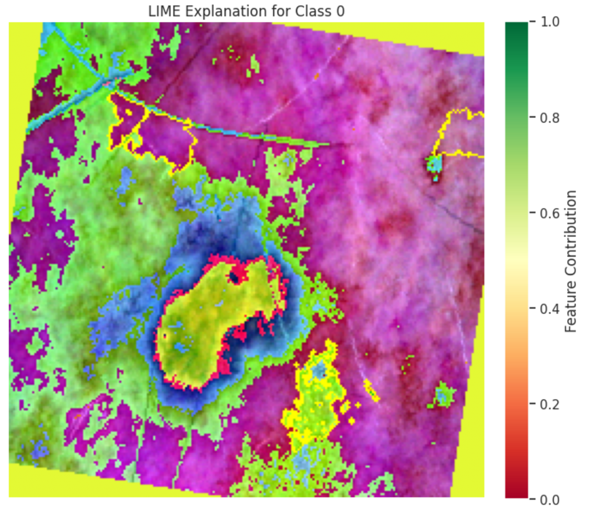
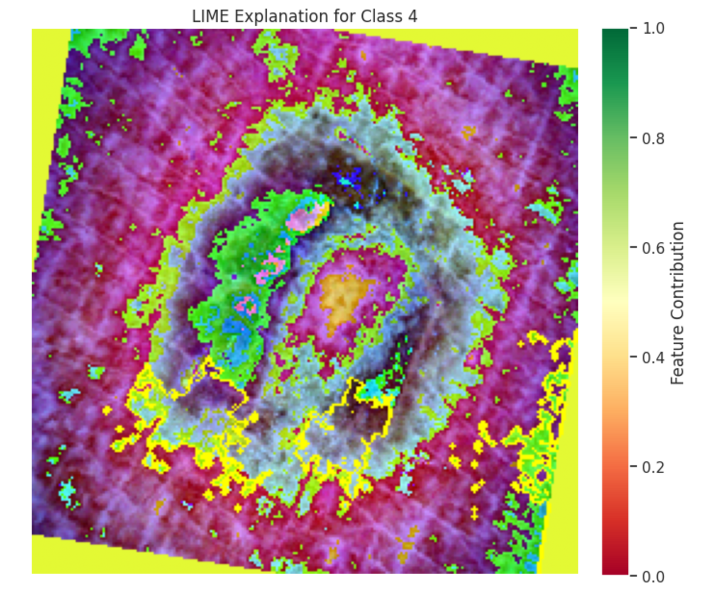

4. **Entropy Visualization**

- Briefly summarize the approach.

Entropy Visualization is a technique used to quantify and display the uncertainty in a model's predictions. Entropy measures the randomness or disorder in a probability distribution, with higher entropy indicating greater uncertainty. For classification tasks, this technique calculates the entropy of the predicted probability distributions for each class. By aggregating and visualizing the entropy for different classes, developers can identify which classes the model finds most or least challenging. This provides insights into prediction confidence and model robustness, especially in cases where the data is imbalanced or ambiguous.

- **Description:**  
  Measures prediction uncertainty, useful for assessing model reliability.
- **Why:**  
  - Helps evaluate robustness and uncertainty.
- **Who:**  
  - Model developers and builders.
- **When:**  
  After training.
- **Where:**  
  Cancer classification.
- **Purpose:**  
  Identifies uncertain predictions, informing areas for improvement.

- Interpret the results here. How does it help to explain your model?

The entropy analysis reveals the average uncertainty for each class in the dataset. Classes like "NV" (Nevus) and "MEL" (Melanoma) showed distinct entropy patterns, reflecting how confidently the model classifies these cases. The bar plot of entropy values across classes highlights variations, where certain classes exhibit higher entropy due to insufficient representation or more ambiguous features in the data (for example: class DF). The visualization enables developers to pinpoint classes that require better training data or model adjustments to reduce uncertainty (DF, AKIEC, BCC - so classes with higher entropy). For example, classes with consistently high entropy may indicate areas where the model struggles or has biases. Overall, entropy visualization provides actionable insights into the model’s reliability and areas for improvement.

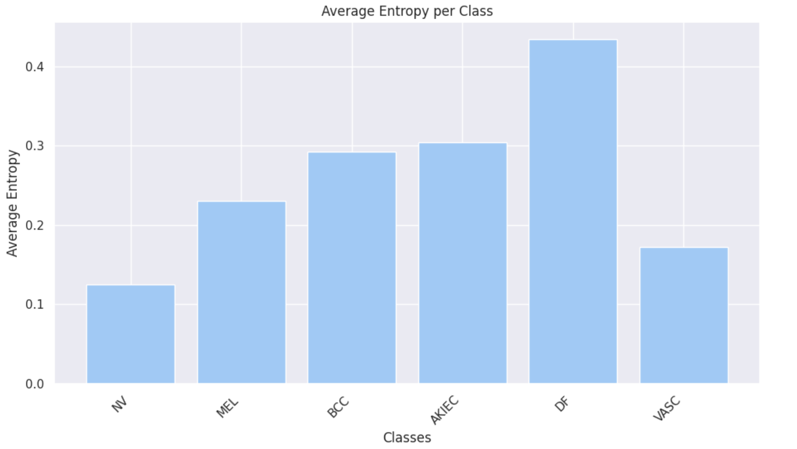

**For Segmentation**

1. **GRAD-CAM**
- Briefly summarize the approach.

Grad-CAM for segmentation models is an explainability technique that visualizes the regions of an image influencing the model's segmentation decisions. By analyzing feature maps and gradients at different layers of the model, Grad-CAM highlights which areas are critical for decision-making at various depths in the network. Each layer focuses on different levels of abstraction, from low-level features (e.g., edges or textures) to high-level semantic features (e.g., lesion shapes). This allows developers to understand how the model processes information across layers. The heatmaps generated for each layer provide a detailed view of the model’s focus and progression in learning relevant features.

- **Description:**  
  Visualizes regions in segmented images that influenced the model's decisions, using heatmaps.
- **Why:**  
  - Debugging and interpretability.
- **Who:**  
  - Model developers and builders.
- **When:**  
  After training.
- **Where:**  
  Cancer segmentation.
- **Purpose:**  
  Highlights which image regions were key for segmentation, ensuring robustness.

- Interpret the results here. How does it help to explain your model?

The Grad-CAM visualizations across the Fuzzy U-Net layers demonstrate a clear progression in feature learning. Early layers focus on low-level features such as textures and edges, mid-layers refine attention toward lesion-specific patterns like pigmentation and borders, and late layers exhibit precise boundary detection that aligns closely with the lesion's ground truth.

These insights are essential for:
- Model Debugging: Ensuring the network learns relevant features at each stage of processing.
- Trust Building: Showing that the model focuses on clinically meaningful regions, increasing confidence in its predictions.
- Performance Validation: Comparing segmentation quality across layers to guide improvements in architecture or training methods.

Grad-CAM serves as a powerful interpretability tool for segmentation models, enabling machine learning practitioners, clinicians, and researchers to better understand and optimize model behavior.

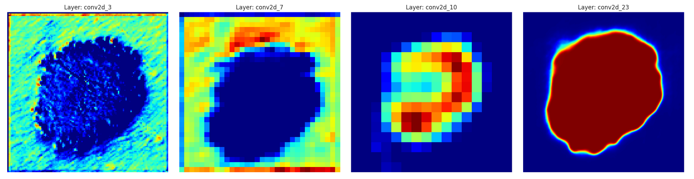
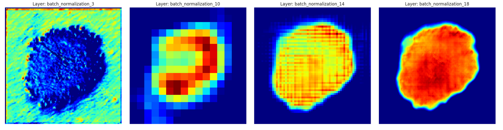

2. **Occlusion Sensitivity**

- Briefly summarize the approach.

Occlusion Sensitivity is an explainability technique that evaluates the impact of occluding parts of an input image on the model's output. By systematically covering regions of the image with a patch (e.g., a black square) and observing changes in the model’s predictions, it identifies critical regions that influence the segmentation decision. This method produces a heatmap showing the sensitivity of the model to occlusions in different areas, with higher sensitivity indicating regions essential for the model’s output. Occlusion Sensitivity is particularly useful for debugging and validating segmentation models, ensuring they focus on relevant parts of the image.

- **Description:**  
  Blocks parts of an input image to measure their impact on predictions, identifying critical regions.
- **Why:**  
  - Debugging and interpretability.
- **Who:**  
  - Model developers and builders.
- **When:**  
  After training.
- **Where:**  
  Cancer segmentation.
- **Purpose:**  
  Identifies areas critical for segmentation, helping validate model behavior.

- Interpret the results here. How does it help to explain your model?

The occlusion sensitivity results show how the model focuses on key areas of the input image for segmentation predictions. The heatmaps reveal high sensitivity (yellow regions) around the lesion, aligning with the segmentation mask, while low sensitivity (blue regions) highlights irrelevant background areas and the lesion itself. For sharp bordered lesions, the occlusion sensitivity shows that the segmentation model mainly focuses on lesion borders/boundaries, as opposed to the classification model which focuses on the lesion itself when classifying a sharp bordered lesion. For blurry bordered lesions, the segmentation model tends to be less focused, cannot find the lesion borders precisely and rather mark surrounding skin parts with high sensitivity (yellow regions), which aligns well with the Grad-CAM results of the classification model for blurry bordered lesions, as this latter visualisation also showed that the most influential parts are the surrounding skin in this case, instead of the lesion itself or the lesion's border. So overall, the occluded images demonstrate how removing specific regions affects the model's output, confirming its reliance on clinically relevant features (like lesion borders). This alignment between the heatmaps and segmentation masks validates the model’s interpretability and robustness. The analysis provides valuable insights into the model's focus and ensures its predictions are reliable and trustworthy. To sum up, occlusion sensitivity provided a clear visualization of the model’s decision-making process, ensuring its robustness and reliability. These insights help clinicians trust that the model targets clinically relevant regions like the lesion's boundary. Researchers and machine learning practitioners can use these findings to improve model robustness by addressing weaknesses, such as over-reliance on the surrounding skin in case of blurry bordered lesions.

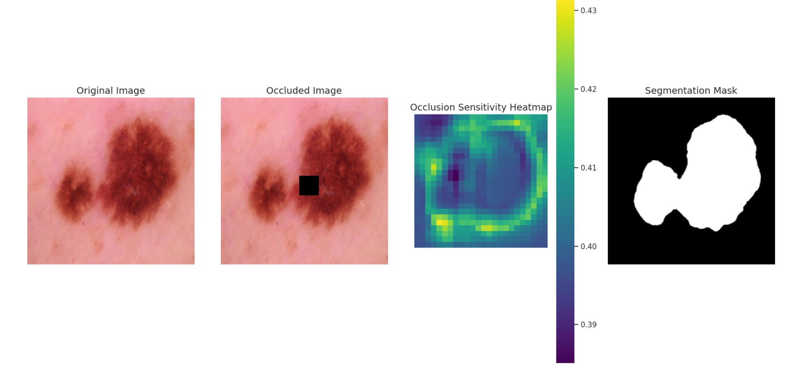
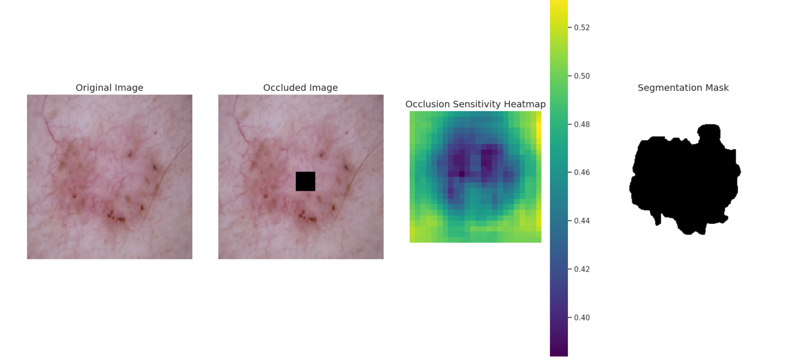
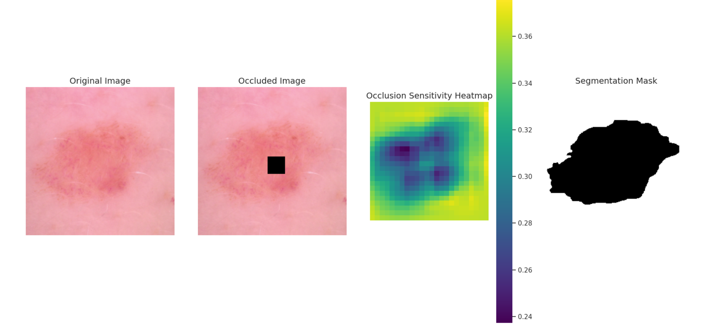

### Summary of Approaches

Using different explainability methods together helps us better understand and trust both classification and segmentation models. **Class Prediction Probabilities** and **Entropy Visualization** show how confident the model (in our case it is rather uncertain) is in its predictions and highlight areas where it might be unsure (for example for classes that are underrepresented in the original dataset, like DF and AKIEC).  **GRAD-CAM** and **LIME** help explain what the model is focusing on when making decisions. GRAD-CAM highlights the areas in the image that influence the model’s choices, such as the shape of a lesion/border of the lesion for the segmentation model and the lesion itself (for example some internal pigmentation patterns) for the classification model, which can help model builders and developers to make sure that the model focuses on important features. Moreover, LIME aims to show which parts of the input image affect the model's predictions, which are proven to be different for sharp and blurry bordered lesion input images as discussed before. For segmentation, **Occlusion Sensitivity** and **GRAD-CAM** work together to make sure the model focuses on the right areas, like the lesion's border/boundary, and not the background/surrounding skin parts. Occlusion Sensitivity shows which parts of the image are most important for the model, confirming what GRAD-CAM found that for the segmentation model the lesion border's/boundaries seem to be the most important. By using all these methods, we can see how the models work, improve their performance, and make them more trustworthy for real-world tasks like skin cancer detection with classification and segmentation.

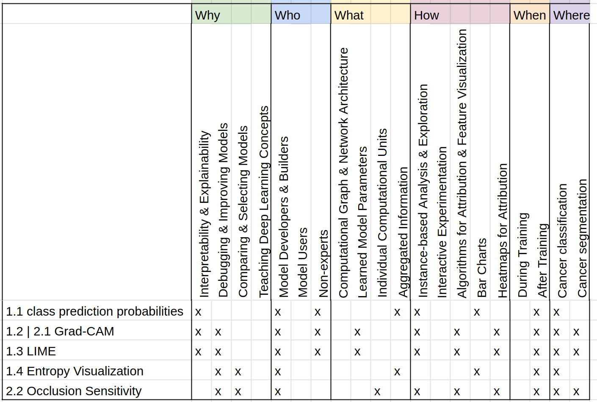

### Presentation Video Link

https://drive.google.com/file/d/1od_eV7t8iEq-0cwOBVxdQ1rBqMswWGCR/view?usp=drivesdk

### References
Adekunle (2022). Entropy; A method for Data Science & Machine Learning. https://thisgoke.medium.com/entropy-a-method-for-data-science-machine-learning-7c3de2c6d82d (accessed in 12/24)  
Akhtar, I. (2024). Skin Cancer Images Segmentation - Fuzzy Unet. https://www.kaggle.com/code/iakhtar0/2-skin-cancer-images-segmentation-fuzzy-unet (accessed in 12/24)  
Amit (2020). Explainable AI Grad-CAM. https://medium.com/@aimldl1984/explainable-ai-grad-cam-8acd04dd2dd3 (accessed in 12/24)  
Foodeei et al. (2024). multiclass-skincancer-torch. https://www.kaggle.com/code/dariusfoodeei/multiclass-skincancer-torch (accessed in 12/24)  
Ghuwalewala (2020). Skin cancer: HAM10000. https://www.kaggle.com/datasets/surajghuwalewala/ham1000-segmentation-and-classification/code (accessed in 12/24)  
Hohman et al. (2018). Visual Analytics in Deep Learning: An Interrogative Survey for the Next Frontiers. 10.1109/TVCG.2018.2843369  
Ribeiro et al. (2016). "Why Should I Trust You?": Explaining the Predictions of Any Classifier. Proceedings of the 22nd ACM SIGKDD international conference on knowledge discovery and data mining. ACM. 10.1145/2939672.2939778  
Zeiler and Fergus (2014). Visualizing and Understanding Convolutional Networks. In European conference on computer vision, pages 818–833. Springer.  


